# NHS Digital Exclusion Support System

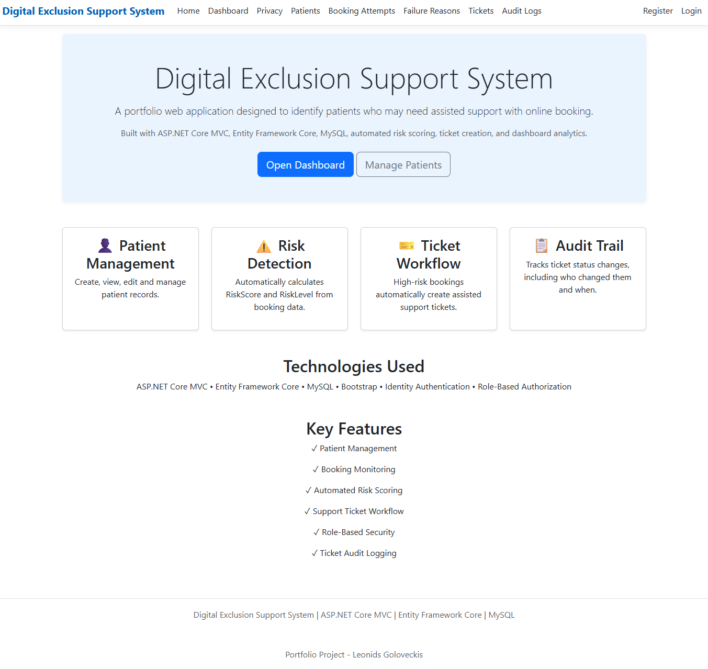

## Project Overview

The NHS Digital Exclusion Support System is a portfolio web application designed to identify patients who may need assisted support with online booking. The system records patients, booking attempts, failure reasons and support tickets. It also includes automated risk scoring, audit logging and Power BI analytics.

## Features

- Patient Management
- Booking Attempt Tracking
- Failure Reason Management
- Assisted Booking Ticket Management
- Dashboard Analytics with Chart.js
- Audit Logging
- Authentication and Authorization

## Technologies Used

- ASP.NET Core MVC
- Entity Framework Core
- MySQL
- LINQ
- Bootstrap
- Power BI
- GitHub

## Security Features

- ASP.NET Core Identity Authentication
- Role-Based Authorization
- Entity Framework Core (SQL Injection Protection)
- Audit Logging
- Input Validation

## Purpose

This project was created as a portfolio application to demonstrate web development, database management, authentication, auditing and analytics skills.

### Screenshots

## Home Page

## Dashboard
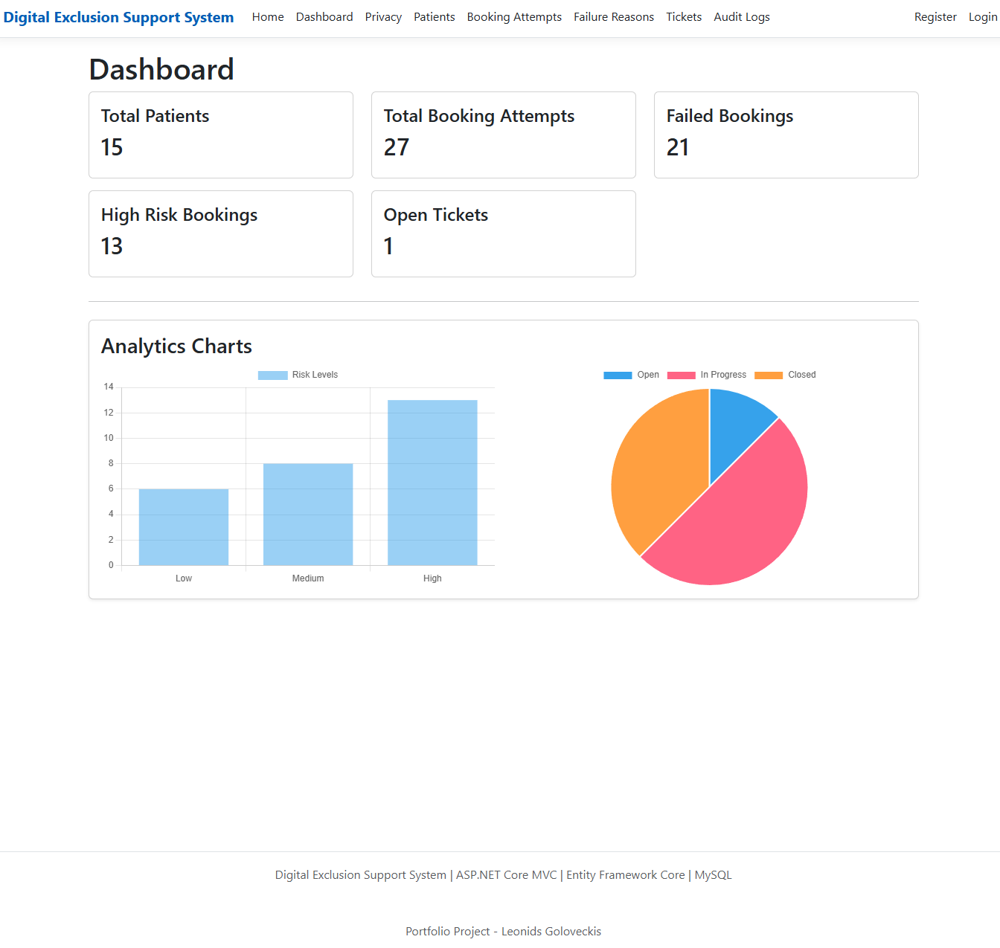

## Patients
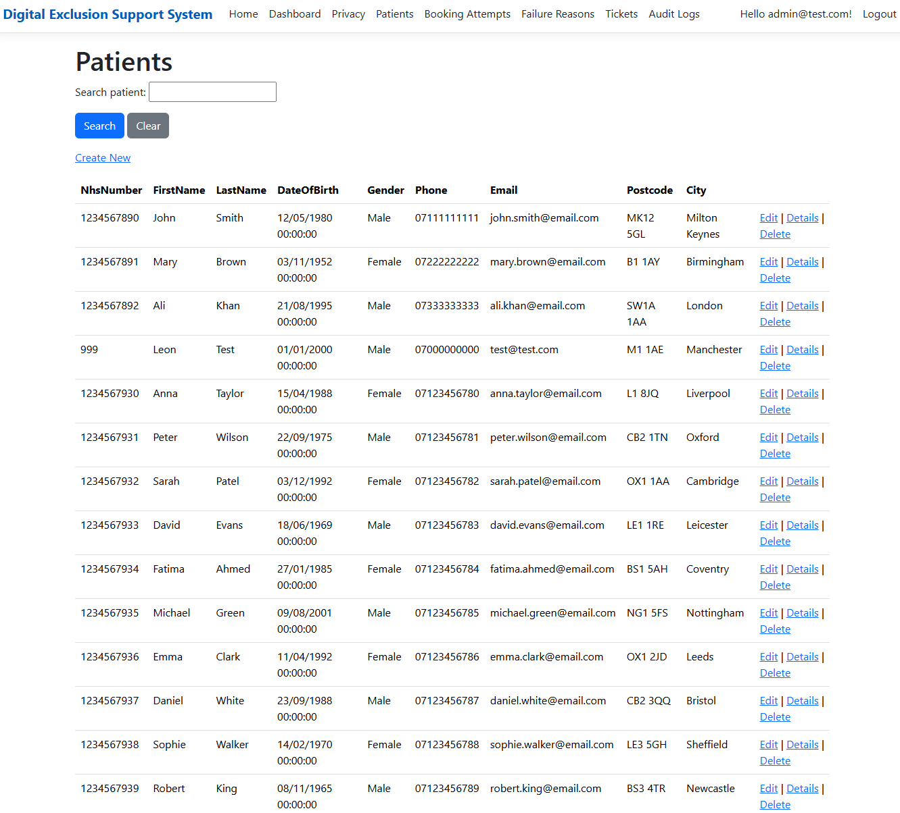

## Booking Attempts
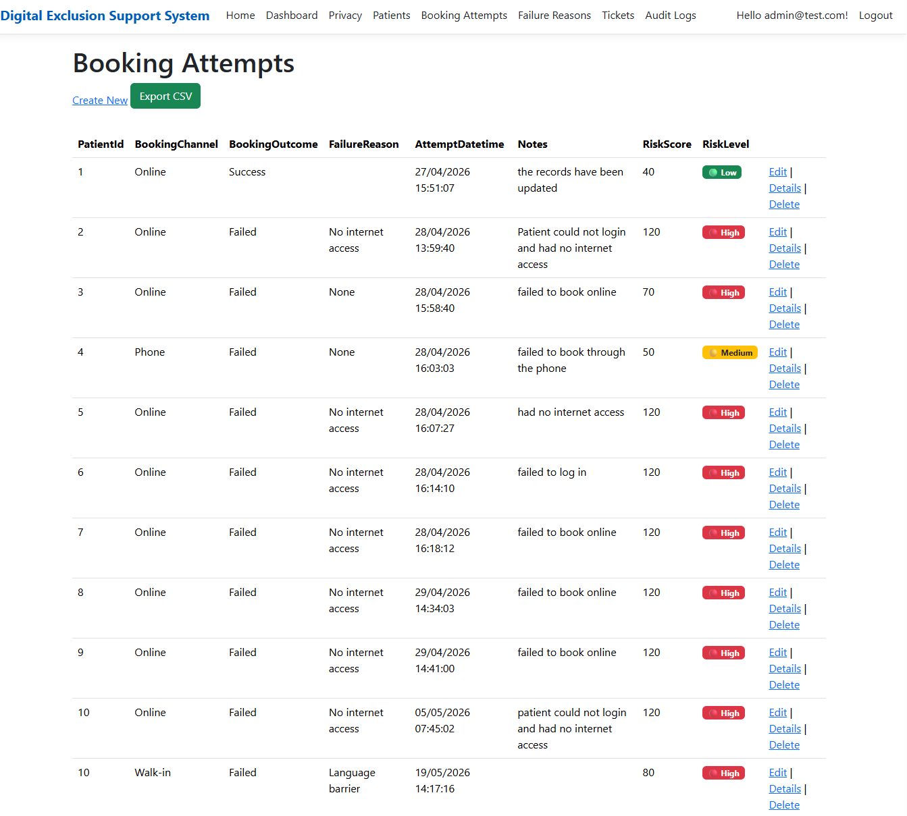

## Failure Reasons
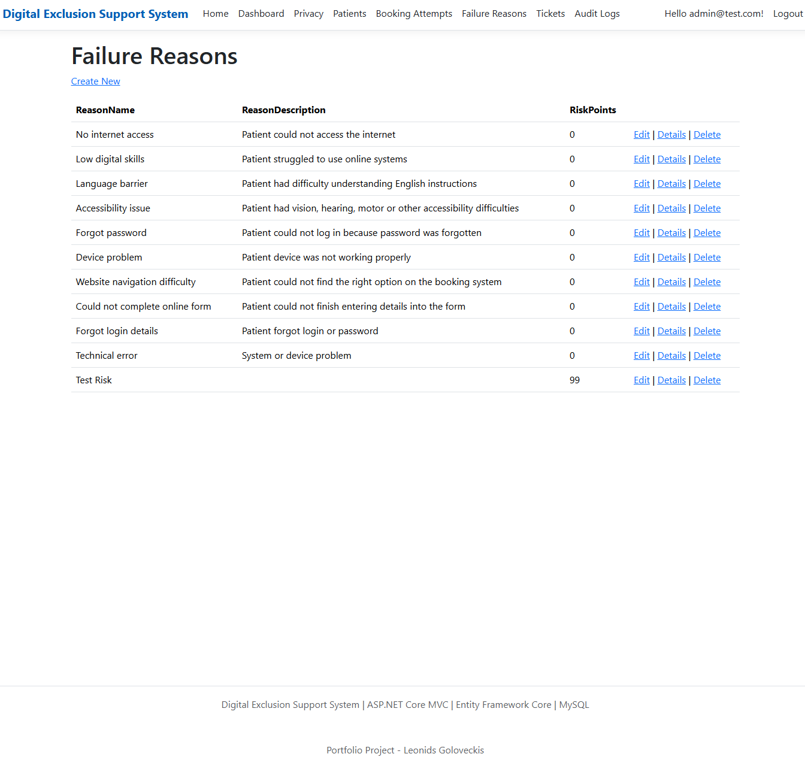

## Tickets
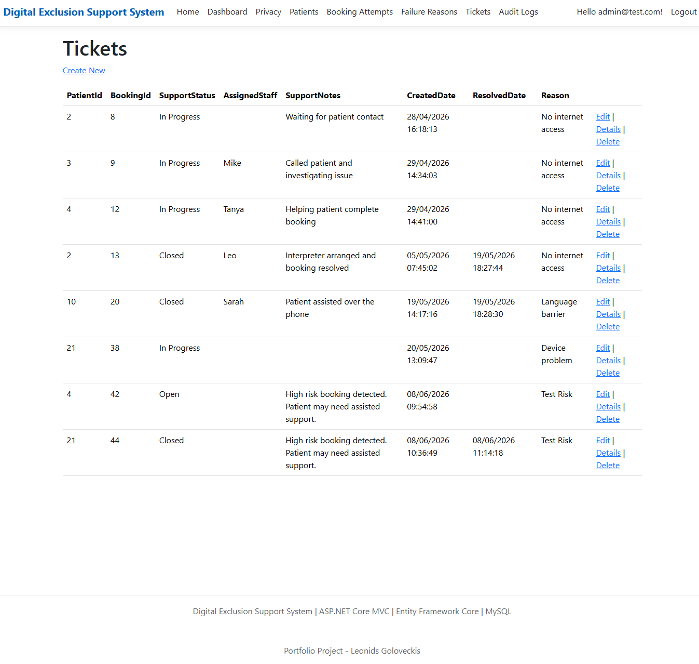

## Audit Logs
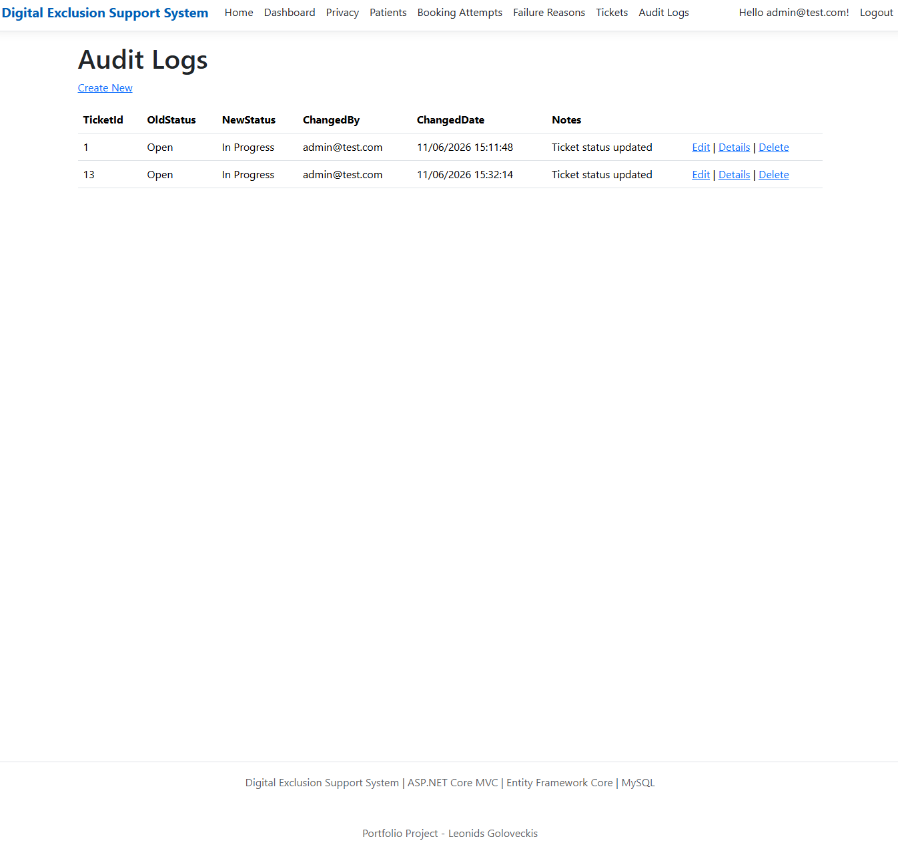

### Power BI Analytics

## Dashboard Overview
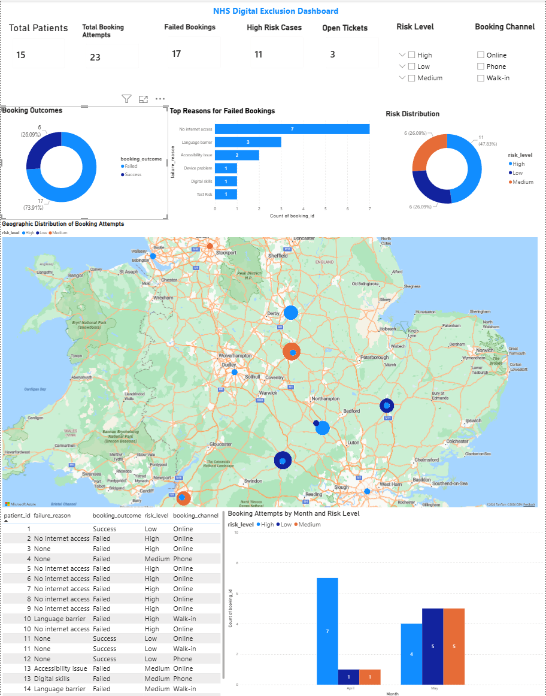

## Map Distribution
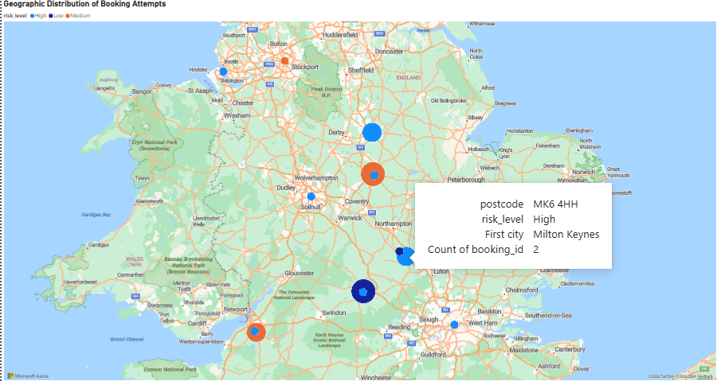

## Risk Analytics
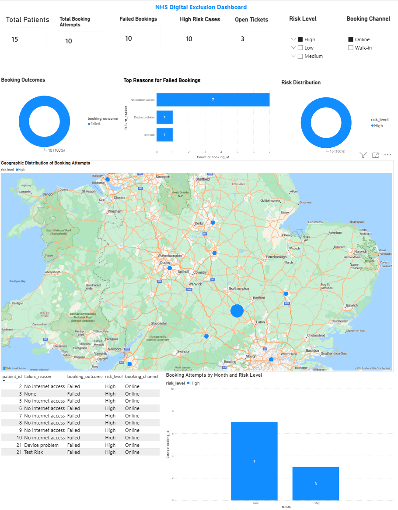

## Failure Reasons Analytics
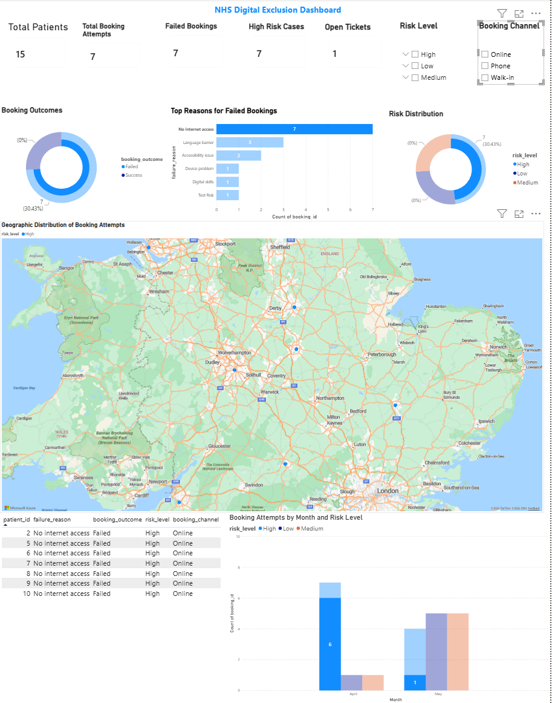

### Author

Leonids Goloveckis
